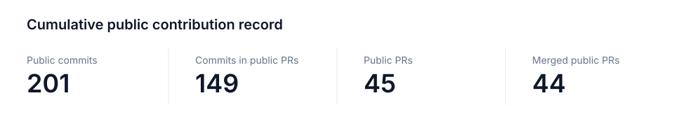
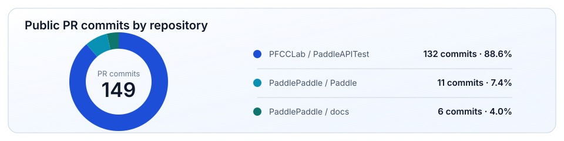

<!-- PROFILE README | yuwu46 -->

  

  
  

<table>
  <tr>
    <td width="50%" valign="top">
      <h3>Research</h3>
      <ul>
        <li>🎓 Graduate student at Beijing Institute of Technology</li>
        <li>🏥 School of Medical Technology · Biomedical Engineering</li>
        <li>🔬 Medical image processing and AI-assisted image segmentation</li>
      </ul>
    </td>
    <td width="50%" valign="top">
      <h3>Engineering</h3>
      <ul>
        <li>⚙️ AI infrastructure: framework reliability and operator compatibility</li>
        <li>🧩 CUDA kernel debugging and large-tensor correctness</li>
        <li>🧪 Regression testing for dependable deep-learning execution</li>
      </ul>
    </td>
  </tr>
</table>

## Cumulative Contribution Record

  

  

## Selected Engineering Work

<table>
  <tr>
    <td width="50%" valign="top">
      
      <h3>Large-tensor <code>paddle.mv</code> reliability</h3>
      
Fixed integer overflow that led to invalid GPU kernel-launch configuration and runtime errors when <code>m * n</code> exceeded the <code>int</code> range.

    </td>
    <td width="50%" valign="top">
      
      <h3>Large-tensor <code>paddle.mode</code> CUDA fix</h3>
      
Resolved CUDA error (700) under large-tensor execution across kernel helper logic and GPU gradient code.

    </td>
  </tr>
</table>

## Toolkit

  

  <b>Programming &amp; Systems</b> 
  Python · C++ · CMake · Git · GitHub · Linux · Docker · CUDA · Scientific Computing

  

  <b>Deep Learning &amp; Vision</b> 
  PyTorch · TensorFlow · PaddlePaddle · Computer Vision · Medical Imaging

  
  
  

  <b>AI Infrastructure</b> 
  GPU Kernels · Model Inference · Framework Reliability · Regression Testing · CI / CD · …

  

