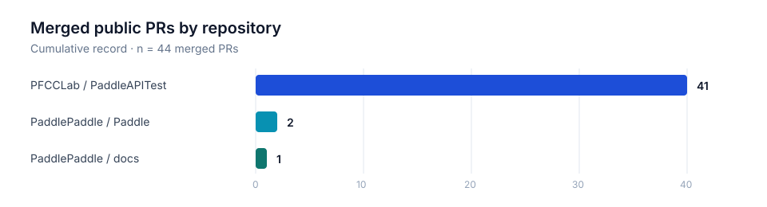

<!-- PROFILE README | yuwu46 -->

  

  
  

  

 

<table border="0">
  <tr>
    <td width="58%" valign="middle">
      <h2>Hi, I'm Wu Yuhan.</h2>
      

        I am a Biomedical Engineering graduate student at <b>Beijing Institute of Technology</b>, in the School of Medical Technology. I work across dependable deep-learning systems and applied medical AI.
      

      

        My hands-on work spans <b>CUDA kernel debugging</b>, <b>large-tensor reliability</b>, and <b>API compatibility / regression engineering</b> in the PaddlePaddle ecosystem.
      

      

        
      

    </td>
    <td width="42%" align="center">
      
    </td>
  </tr>
</table>

 

  
  
  
  

## Contribution Workload

  

  Public GitHub PR record: 45 submitted, 44 merged (97.8%). Counts are cumulative and intentionally do not depend on recent activity.

<table>
  <thead>
    <tr><th align="left">Contribution stream</th><th align="right">Merged PRs</th><th align="right">Share of merged record</th><th align="left">Evidence</th></tr>
  </thead>
  <tbody>
    <tr><td>API compatibility and regression engineering</td><td align="right">41</td><td align="right">93.2%</td><td><a href="https://github.com/PFCCLab/PaddleAPITest/pulls?q=is%3Apr+author%3Ayuwu46+is%3Aclosed">PFCCLab/PaddleAPITest</a></td></tr>
    <tr><td>Deep-learning framework / CUDA kernels</td><td align="right">2</td><td align="right">4.5%</td><td><a href="https://github.com/PaddlePaddle/Paddle/pulls?q=is%3Apr+author%3Ayuwu46+is%3Aclosed">PaddlePaddle/Paddle</a></td></tr>
    <tr><td>Technical documentation</td><td align="right">1</td><td align="right">2.3%</td><td><a href="https://github.com/PaddlePaddle/docs/pull/7058">PaddlePaddle/docs</a></td></tr>
  </tbody>
</table>

Method: counts are grouped from publicly visible PRs authored by <a href="https://github.com/yuwu46">@yuwu46</a>; shares use 44 merged public PRs as the denominator.

## Featured Engineering Work

<table>
  <tr>
    <td width="50%" valign="top">
      
      <h3>Large-tensor <code>paddle.mv</code> reliability</h3>
      
Diagnosed integer overflow when <code>m * n</code> exceeded the <code>int</code> range, avoiding invalid GPU kernel-launch configuration and runtime errors. Updated the gradient-kernel path and verified accuracy behavior.

      
<b>Focus:</b> CUDA · C++ · GPU kernels · numerical correctness

    </td>
    <td width="50%" valign="top">
      
      <h3>Large-tensor <code>paddle.mode</code> CUDA fix</h3>
      
Resolved a reproducible CUDA error (700) under large-tensor execution across kernel helper logic and GPU gradient code.

      
<b>Focus:</b> CUDA debugging · large-scale execution · framework engineering

    </td>
  </tr>
  <tr>
    <td colspan="2" valign="top">
      
      <h3>Compatibility and regression engineering</h3>
      
Expanded test and configuration coverage for operator compatibility, zero-size tensors, error paths, and dtypes including <code>bfloat16</code>.

    </td>
  </tr>
</table>

## Toolkit

  

  
  
  
  
  

## Research Direction

<table border="0">
  <tr>
    <td width="50%" valign="top">
      <h3>Medical image processing</h3>
      
My academic focus is medical image processing, with particular interest in AI-assisted analysis and segmentation for healthcare applications.

    </td>
    <td width="50%" valign="top">
      <h3>From research to reliable deployment</h3>
      
I am interested in connecting medical AI research with efficient, dependable deep-learning infrastructure: correct kernels, robust testing, and reproducible execution at scale.

    </td>
  </tr>
</table>

 

<table border="0">
  <tr>
    <td width="50%" valign="top">
      <h2>Career Snapshot</h2>
      
🎓 <b>Education</b> Graduate Student, Biomedical Engineering Beijing Institute of Technology

      
🔭 <b>Research interest</b> Medical image processing · AI-based image segmentation · deep learning in healthcare

      
💼 <b>Target roles</b> AI Systems · ML Infrastructure · GPU / CUDA Engineering · Applied Medical AI

    </td>
    <td width="50%" valign="top">
      <h2>Open-source Record</h2>
      
✓ <a href="https://github.com/PaddlePaddle/Paddle/pull/73537">PaddlePaddle core: large-tensor <code>mv</code> fix</a>

      
✓ <a href="https://github.com/PaddlePaddle/Paddle/pull/73174">PaddlePaddle core: large-tensor <code>mode</code> fix</a>

      
✓ <a href="https://github.com/PaddlePaddle/docs/pull/7058">PaddlePaddle Docs contribution</a>

      
✓ <a href="https://github.com/PFCCLab/PaddleAPITest/pulls?q=is%3Apr+author%3Ayuwu46+is%3Aclosed">Paddle API compatibility PR history</a>

    </td>
  </tr>
</table>

 

  
<b>View cumulative GitHub metrics</b>

   
  
   
  This optional card is generated weekly by the included workflow and presents cumulative code, repository, language, and contribution data - not a recent-activity feed.

 

  

